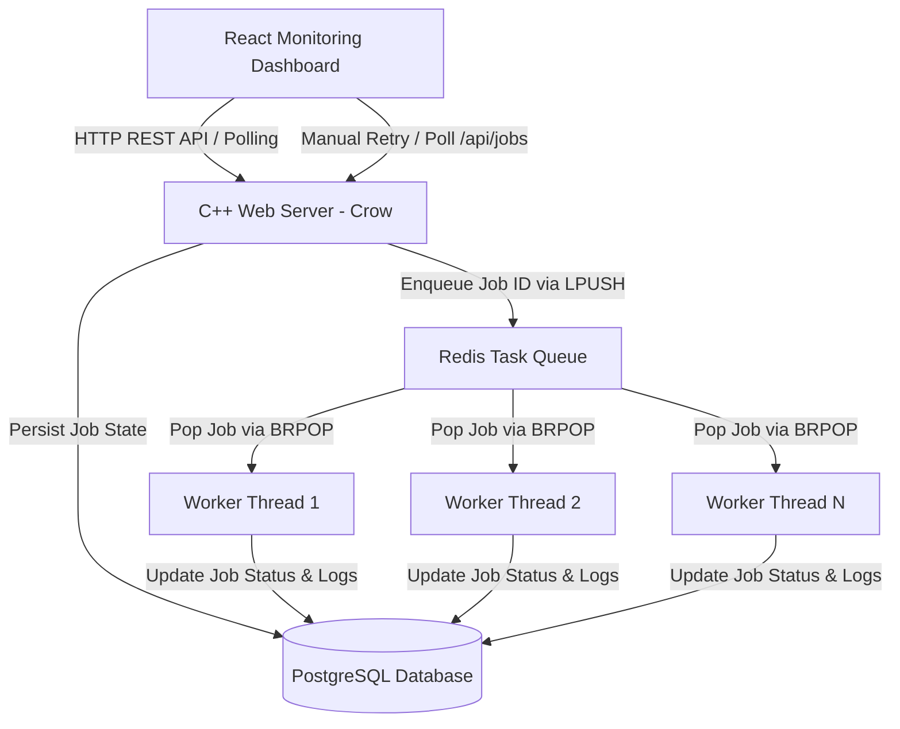

<div align="center">

# ⚙️ Distributed Background Job Platform

**A high-performance, production-grade distributed task processing engine & real-time monitoring dashboard.**

Built with **C++17 (Crow, libpqxx, hiredis)**, **PostgreSQL 15**, **Redis 7**, and **React 18 (Vite + TailwindCSS v4)**.

[](https://en.cppreference.com/w/cpp/17)
[](https://github.com/CrowCpp/Crow)
[](https://redis.io/)
[](https://www.postgresql.org/)
[](https://react.dev/)
[](https://tailwindcss.com/)
[](https://www.docker.com/)
[](LICENSE)

</div>

---

## 📌 Overview

Modern web applications require asynchronous task execution to keep user interfaces responsive while running heavy compute operations—such as image manipulation, document rendering, and email dispatch.

This repository provides an **end-to-end, production-ready distributed background job orchestration platform**. The core engine is engineered in **modern C++ (C++17)** for optimal thread scheduling and low-latency API handling, paired with **Redis** for lightweight, non-blocking task queuing and **PostgreSQL** for persistent audit trails.

A sleek **glassmorphic React dashboard** allows developers to dispatch tasks, monitor worker thread allocation in real time, inspect structured job execution logs, and trigger error recovery mechanisms.

---

## ✨ Key Features

- 🚀 **Ultra-Fast C++ Backend Core**: Built on the **Crow v1.2.0** micro-web framework with zero-overhead async HTTP request processing and global CORS handling.
- ⚡ **Concurrent Worker Thread Pool**: Spawns $N$ independent worker threads that block-dequeue jobs from Redis via `BRPOP`, completely eliminating CPU busy-waiting.
- 🛡️ **Thread-Safe DB Connection Pooling**: Manages PostgreSQL connections dynamically via custom `libpqxx` connection pools with `std::shared_ptr` automatic reclamation.
- 🔄 **At-Least-Once Delivery & Auto-Retry**: Built-in exponential backoff & retry mechanics re-queue failed tasks up to 3 times before moving them to a terminal `FAILED` state.
- 🧪 **Interactive Fault Injection**: Test system resiliency on demand by injecting simulated transient timeouts (`fail_attempts`) or permanent failures (`fail: true`) directly into task payloads.
- 🎨 **Glassmorphic React Monitoring UI**: A modern dashboard built with React 18 and TailwindCSS v4 featuring automatic 3-second live polling, status metrics, and interactive task triggers.
- 🐳 **Containerized Microservices Architecture**: Fully containerized using Docker & Docker Compose with container health checks and signal-safe graceful shutdown loops.

---

## 🏗️ System Architecture



---

## 💻 Technical Stack & Engineering Decisions

| Domain | Technology | Version | Rationale & Architectural Purpose |
|---|---|---|---|
| **Backend Core** | C++ | C++17 | Native execution speed, precise thread management, low overhead |
| **HTTP Framework** | Crow | v1.2.0 | C++ header-only micro-framework for asynchronous REST routing |
| **Task Queue** | Redis | 7.0-alpine | Transient, high-throughput task buffer using `LPUSH` / `BRPOP` primitives |
| **Persistence** | PostgreSQL | 15-alpine | ACID-compliant relational DB storing audit history, parameters, & state |
| **DB Driver** | libpqxx | 7.x | Official C++ client library wrapped in a thread-safe connection pool |
| **Queue Driver** | hiredis | 1.x | C client library for non-blocking C++ Redis protocol interaction |
| **Frontend Framework**| React | 18.3 | Reactive UI layer managing real-time task polling and execution states |
| **Styling** | TailwindCSS | v4.0 | Utility-first styling powering glassmorphic dark design tokens |
| **Build System** | CMake / Vite | 3.22 / 5.4 | Cross-platform C++ build system & ultra-fast frontend bundler |
| **Orchestration** | Docker Compose | v2+ | Single-command multi-container deployment with dependency health checks |

---

## 📁 Directory Structure

```
distributed-job-platform/
├── backend/
│   ├── include/
│   │   ├── db.h               # Thread-safe PostgreSQL connection pool & CRUD declarations
│   │   ├── job_queue.h        # Redis queue push/blocking pop client header
│   │   ├── worker.h           # Task processing loop & simulator logic header
│   │   └── worker_pool.h      # Worker thread pool lifecycle manager
│   ├── src/
│   │   ├── db.cpp             # PostgreSQL pool recycling & SQL query implementation
│   │   ├── job_queue.cpp      # LPUSH / BRPOP hiredis thread-safe wrappers
│   │   ├── main.cpp           # Crow REST web server routes & initialization
│   │   ├── worker.cpp         # Task execution simulation, retry engine & status logger
│   │   └── worker_pool.cpp    # Thread spawning, join management & signal handlers
│   ├── CMakeLists.txt         # CMake target definitions & FetchContent for Crow
│   └── Dockerfile             # Multi-stage Docker build targeting Ubuntu 22.04
├── db/
│   └── schema.sql             # PostgreSQL schema definition & initial tables
├── frontend/
│   ├── src/
│   │   ├── App.jsx            # App state manager & periodic poll coordinator
│   │   ├── Dashboard.jsx      # Metrics overview, status cards & expandable log viewers
│   │   ├── SubmitJob.jsx      # Task submission modal with fault-injection triggers
│   │   ├── main.jsx           # React DOM root entrypoint
│   │   └── index.css          # TailwindCSS v4 directives & glassmorphic styling
│   ├── package.json           # React dependencies & NPM scripts
│   ├── vite.config.js         # Development server & proxy configuration
│   ├── nginx.conf             # Production Nginx reverse proxy configuration
│   └── Dockerfile             # Multi-stage Node.js build & Nginx runtime Dockerfile
├── docker-compose.yml         # Container orchestration with service health dependencies
└── README.md                  # Comprehensive system documentation
```

---

## 🔌 API Reference

| Method | Endpoint | Description | Request Payload | Response Status |
|---|---|---|---|---|
| `GET` | `/api/jobs` | Retrieve all job execution logs & metrics | *None* | `200 OK` |
| `GET` | `/api/jobs/:id` | Retrieve status & result for a specific job ID | *None* | `200 OK` / `404 Not Found` |
| `POST` | `/api/jobs` | Enqueue a new background task | `{ "type": "IMAGE_RESIZE", "payload": {} }` | `201 Created` / `400 Bad Request` |
| `POST` | `/api/jobs/:id/retry` | Manually re-enqueue a `FAILED` or `COMPLETED` job | *None* | `200 OK` / `404 Not Found` |

---

## ⚙️ Simulated Task Workloads & Fault Injection

The platform supports 3 built-in simulated workloads designed to test realistic execution scenarios:

1. 🖼️ **`IMAGE_RESIZE`**: Simulates image processing & spatial scaling. Execution time: **2.0s**. Returns target dimensions and saved path.
2. 📄 **`PDF_GENERATE`**: Simulates document compiling & formatting. Execution time: **3.0s**. Returns page count and binary payload metrics.
3. 📧 **`EMAIL_SEND`**: Simulates transactional SMTP delivery. Execution time: **1.0s**. Returns dispatch timestamp and message ID.

### 🧪 Fault Injection Modes
Test system fault tolerance in real time using payload flags:
- 💥 **Permanent Failure (`"fail": true`)**: Forces task execution to throw an exception across all attempts. The task retries 3 times before settling into `FAILED`.
- ⚠️ **Transient Failure (`"fail_attempts": N`)**: Simulates temporary downstream timeouts for $N$ attempts (e.g. `"fail_attempts": 2`). The worker fails twice, re-enqueues, and succeeds on attempt $3$.

---

## 🚀 Quick Start

### 📋 Prerequisites
Ensure you have **Docker** and **Docker Compose** installed on your system.

### 1️⃣ Clone & Navigate
```bash
git clone https://github.com/Krish2600/distributed-job-orchestrator.git
cd distributed-job-orchestrator
```

### 2️⃣ Launch the Microservices Stack
```bash
docker compose up --build
```

### 3️⃣ Access the Applications
- **🖥️ React Web Dashboard**: [http://localhost:3000](http://localhost:3000)
- **🔌 C++ REST API Base**: [http://localhost:8081/api/jobs](http://localhost:8081/api/jobs)

### 🛑 Graceful Shutdown
To safely terminate all running services without interrupting in-flight worker tasks:
```bash
docker compose down
```
> **Note**: The C++ backend captures `SIGINT` / `SIGTERM` signals, stops accepting new dequeues, lets active workers complete within their execution window, and gracefully joins threads within 1 second.

---

## 🛡️ Reliability & Resiliency Engineering

- 🔁 **Database Startup Retry Loop**: The C++ backend automatically executes a connection retry loop (up to 15 retries with exponential backoff) during startup, guaranteeing smooth container boot sequence even if PostgreSQL takes time to initialize.
- 🔒 **Race-Condition-Free Dequeuing**: Workers use Redis blocking pop (`BRPOP`), eliminating polling overhead and atomic race conditions across multiple parallel worker threads.
- ⚡ **Graceful Thread Pool Termination**: Thread cancellation is handled cleanly by updating atomic boolean flags (`running = false`) and unlocking waiting worker threads gracefully.

---

## 📜 License

Distributed under the **MIT License**.
