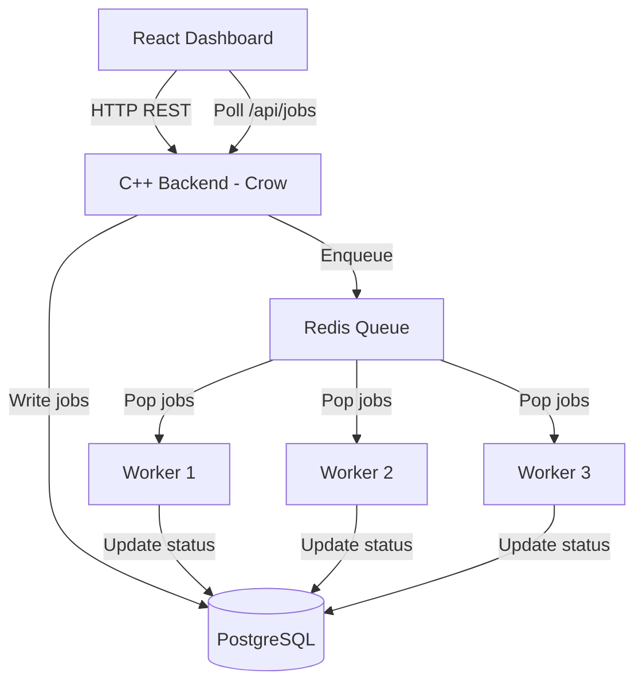

# Distributed Background Job Processing Platform

A production-grade concurrent background job processing platform built using **C++ (Crow, hiredis, libpqxx)**, **PostgreSQL**, **Redis**, and **React (Vite + TailwindCSS v4)**. 

This project demonstrates core backend systems engineering concepts, including asynchronous task queues, concurrent thread pools, connection pooling, fault tolerance/retry logic, and real-time state monitoring.

---

## Architecture Diagram



---

## Technical Stack & Architectural Decisions

*   **Backend Server (Crow)**: A high-performance, lightweight C++ micro web framework. Implements a global CORS middleware to support pre-flight requests and handles REST endpoints.
*   **Database (PostgreSQL & libpqxx)**: Stores persistent job records (type, status, parameters, result, timelines, attempts). Utilizes a thread-safe connection pool recycling connections via `std::shared_ptr` custom deleters.
*   **Message Queue (Redis & hiredis)**: Serves as the transient task queue. The backend pushes job IDs using `LPUSH`, and workers retrieve them using `BRPOP` (blocking pop) to avoid busy-waiting.
*   **Workers (C++ threads)**: Thread pool pattern spawning $N$ independent worker threads. Each thread manages its own Redis connection to perform blocking dequeues safely.
*   **Fault Tolerance & Resiliency**:
    *   **At-least-once delivery**: Failed tasks automatically re-enqueue back to Redis for retry up to 3 times before transitioning permanently to `FAILED`.
    *   **Startup connection retry loop**: The C++ server retries connection to PostgreSQL up to 15 times on startup, avoiding container crashes if the database is booting slowly.
*   **Frontend (React + TailwindCSS v4)**: A glassmorphic UI displaying real-time task metrics, execution logs, and collapsible task parameter viewers with automatic 3s polling and manual retry hooks.

---

## Directory Structure

```
distributed-job-platform/
├── backend/
│   ├── include/
│   │   ├── db.h               # Connection pool and PostgreSQL CRUD declarations
│   │   ├── job_queue.h        # hiredis queue push/connect wrapper
│   │   ├── worker.h           # Worker processing loop declaration
│   │   └── worker_pool.h      # Worker thread pool lifecycle manager
│   ├── src/
│   │   ├── db.cpp             # Connection pooling and CRUD implementation
│   │   ├── job_queue.cpp      # Thread-safe LPUSH/BRPOP hiredis wrappers
│   │   ├── main.cpp           # Crow server initialization and API routing
│   │   ├── worker.cpp         # Worker task simulator, failure checker and retrier
│   │   └── worker_pool.cpp    # Thread spawning and graceful shutdown triggers
│   ├── CMakeLists.txt         # CMake build configuration with FetchContent
│   └── Dockerfile             # Multi-stage release build targetting Ubuntu 22.04
├── db/
│   └── schema.sql             # DB initialization schema script
├── frontend/
│   ├── src/
│   │   ├── App.jsx            # State coordinator and auto-polling trigger
│   │   ├── Dashboard.jsx      # Stat dashboard and expandable logs list
│   │   ├── SubmitJob.jsx      # Task creator form with simulated error switches
│   │   ├── main.jsx           # React app mount
│   │   └── index.css          # TailwindCSS v4 imports and scrollbars
│   ├── package.json           # Node configuration and packages
│   ├── vite.config.js         # Proxy routing rules
│   ├── nginx.conf             # Production reverse proxy serving React statically
│   └── Dockerfile             # Node compilation & Nginx deployment Dockerfile
├── docker-compose.yml         # Container orchestration with healthchecks
└── README.md                  # System documentation
```

---

## API Endpoints

| Method | Endpoint | Description | Request Body | Response Status |
|---|---|---|---|---|
| **GET** | `/api/jobs` | Retrieve all job logs | N/A | `200 OK` |
| **GET** | `/api/jobs/:id` | Retrieve single job status | N/A | `200 OK` / `404 Not Found` |
| **POST** | `/api/jobs` | Create and enqueue a new task | `{ "type": "IMAGE_RESIZE", "payload": {} }` | `201 Created` / `400 Bad Request` |
| **POST** | `/api/jobs/:id/retry` | Re-enqueue a failed/succeeded job | N/A | `200 OK` / `404 Not Found` |

---

## Simulated Job Types

1.  **`IMAGE_RESIZE`**: Simulates image compression. Takes **2 seconds**. Returns output resolution and temporary file save path.
2.  **`PDF_GENERATE`**: Simulates document compiler. Takes **3 seconds**. Returns page counts and simulated file sizes.
3.  **`EMAIL_SEND`**: Simulates SMTP relay. Takes **1 second**. Returns mail receipts and transactional IDs.

### Fault Injection (Simulated Errors)
To test the resilience of the platform, the frontend allows injecting faults directly inside the job payloads:
*   **Permanent Failure (`"fail": true`)**: The worker will throw an error on all attempts. The job will retry 3 times and then transition to `FAILED`.
*   **Temporary Failure (`"fail_attempts": N`)**: The worker will raise errors for the first $N$ attempts (e.g. simulating temporary API timeouts) and succeed on attempt $N+1$.

---

## How to Run

### Prerequisite
Ensure **Docker** and **Docker Compose** are installed and running (start Docker Desktop first).

### Booting the Stack
1. Clone or open the project folder in your terminal:
   ```bash
   cd distributed-job-platform
   ```
2. Build and start the containers:
   ```bash
   docker compose up --build
   ```
3. Open your browser and navigate to:
   *   **React UI**: [http://localhost:3000](http://localhost:3000)
   *   **Backend API**: [http://localhost:8080/api/jobs](http://localhost:8080/api/jobs)

### Graceful Shutdown
To stop the services and verify worker threads complete execution safely without losing jobs:
```bash
docker compose down
```
The C++ backend intercepts the shutdown signals, lets running workers complete their task window, and joins all threads gracefully within 1 second.
